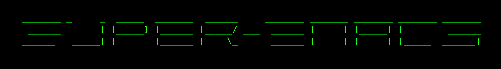

# super-emacs

  

An out-of-the-box Emacs configuration with super powers, now also on Docker!

## Video

## Setup

Clone the repository with

    git clone https://github.com/myTerminal/super-emacs

or download the repository as an archive and place it at your `home` directory. Once done, start Emacs or well, super Emacs.

## Docker

Pull super-emacs docker image and start `emacs`

    docker pull myterminal/super-emacs

## Features

1. Minimal interface with almost everything except the window turned off
2. [Material theme](https://github.com/cpaulik/emacs-material-theme) applied by default, with a readable font-size
3. [MELPA](http://melpa.org) added as a package archive
4. Navigation through buffers simplified with [winner](http://emacswiki.org/emacs/WinnerMode) and [windmove](http://emacswiki.org/emacs/WindMove).
5. See command suggestions when `C-x` is pressed, using `which-key`
6. Super-easy file system navigation with `neotree`
7. No more welcome screen, Emacs starts up to greet you and shows the date
8. Reload file in a buffer quickly with `<f5>`

### Pre-configured packages

1. [helm](https://github.com/emacs-helm/helm) to take your Emacs experience to the next level
2. [multiple-cursors](https://github.com/magnars/multiple-cursors.el) to be able to edit text in style
3. [ace-jump-mode](https://github.com/winterTTr/ace-jump-mode) to be able to jump around quickly
4. [powerline](https://github.com/milkypostman/powerline) to decorate your mode-line and make it more informative
5. [switch-window](https://github.com/dimitri/switch-window) to be able to switch windows visually
6. [buffer-move](http://www.emacswiki.org/emacs/buffer-move.el) for moving buffers within windows quickly
7. [auto-complete](https://github.com/auto-complete/auto-complete) for easy text editing
8. [ztree](https://github.com/fourier/ztree) for an efficient directory tree comparison
9. [undo-tree](https://github.com/emacsmirror/undo-tree) to be able to visualize your changes in a buffer
10. [neotree](https://github.com/jaypei/emacs-neotree) to be able to spawn a tree at any directory
11. [dired-launch](https://github.com/thomp/dired-launch) to be able to open files with their default applications from within `dired`
12. [which-key](https://github.com/justbur/emacs-which-key) to be suggested with what you can do after pressing `C-x`
13. [meta-presenter](https://github.com/myTerminal/meta-presenter) for presenting slide-shows from within Emacs
14. [myterminal-controls](https://github.com/myTerminal/myterminal-controls) for quick-toggle controls at a key-stroke
15. [theme-looper](https://github.com/myTerminal/theme-looper) for switching themes in style

### Key-bindings

Refer [key-bindings.el](.emacs.d/super-emacs/key-bindings.el) for all the pre-configured key-bindings for your convenience.
